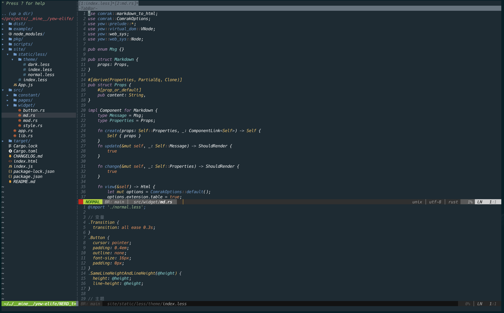

# 我的vim配置

最近一直在尝试从`IDE`切换到`vim`平台作为日常开发的主力。想了一下有几个好处。

1. `linux`的服务器上，更好地操作文件/意味着云编码的可能性很大
2. 减少鼠标的依赖，告别鼠标手/键盘手正在路上
3. 更快更高效。比如也可以用来写`markdown`文件，配合`mdcat`，也可以得到一个好效果。

话不多说。讲一下配置路径。(`macOS`为示例)

### 了解和下载vim

[官方下载地址](https://www.vim.org/download.php)

安装完后有两个路径需要你关注

```
# vim的配置文件、插件什么的都在这里
~/.vim

# vim的配置文件
~/.vimrc
```

然后就是掌握一两个插件管理器，虽然从零开始配置也是可以选择的方式，但是有好的第三方插件可以加速我们的配置。

常用的有

1. `pathogen` 单独脚本，自动帮你安装插件
2. `vundle` 需要配置，安装方式为:PluginInstall
3. `vim-plug` 和上面的大同小异

vim的版本有很多(扩展包)

1. `gvim` gui版本
2. `macvim` mac定制版本
3. `neovim` 面向未来的vim版本
3. ...


### 配置步骤

#### `nerdtree`

首先就是安装神器[nerdtree](https://github.com/preservim/nerdtree), 可以在窗口模拟文件系统。

有了这个文件管理神器，你就会逐步爱上使用vim来开发项目。

当然`nerdtree`还有一些其他的扩展，比如给列表增加高亮和图标库(实际上对命令行来说就是字体)

- 安装 `vim-nerdtree-syntax-highlight`

上面提到的高亮插件，需要搭配字体使用

- 安装 `vim-devicons`

当然，字体也需要安装

- 安装 `nerd fonts` 


上面提到的所有插件都可以用google查到。都是github的开源项目

#### `nerd fonts`

字体是可以用``homebrew`下载的(其他平台也有各自的下载方式)，官方也提供了更多的自定义字体的方式。

我用的是iterm。这时把`preference -> text -> font`改为我们刚才安装的字体。再在任意一个目录内执行`vim .`，就可以出现漂亮的图片了。

#### 色彩

vim可以用`:colorscheme xxx`来修改配色。`colorscheme`也可以配置在`.vimrc`里面。我用的是`colorscheme OceanicNext`，这个`OceanicNext`也是一个vim插件，可以下载。

#### 对应的语言支持

语言支持其实是可以用另一个必备的神器。`YouCompleteMe`。这个安装稍微有点麻烦，其依赖的第三方包也比较多，可以花点耐心安装。

日常开发，上面提到的应该就够用了。但是还有几个场景需要vim也强力支持

- 文件内查找/跳转定义/替换
- 项目内查找/替换
- 其他比如多终端、debug等等
- 多行操作

但是上面的应该也有对应的解决方案。慢慢探索。

### 最终效果

配置了上面提到的几个内容。





### 配置

- `vim`
- `macvim`
- `nerdtree`
- `vim-nerdtree-syntax-highlight`
- `YouComplementMe`

```vimrc

execute pathogen#infect()
syntax on
set encoding=UTF-8
" filetype plugin indent on


" Note: Skip initialization for vim-tiny or vim-small.
if 0 | endif

if &compatible
  set nocompatible               " Be iMproved
endif

" Required:
set runtimepath+=~/.vim/bundle/neobundle.vim/

" Required:
call neobundle#begin(expand('~/.vim/bundle/'))

" Let NeoBundle manage NeoBundle
" Required:
NeoBundleFetch 'Shougo/neobundle.vim'

" My Bundles here:
" Refer to |:NeoBundle-examples|.
" Note: You don't set neobundle setting in .gvimrc!
NeoBundle 'tiagofumo/vim-nerdtree-syntax-highlight'
NeoBundle 'ryanoasis/vim-devicons'
" NeoBundle 'rust-lang/rust.vim'
NeoBundle 'sheerun/vim-polyglot'
NeoBundle 'racer-rust/vim-racer'
NeoBundle 'mhartington/oceanic-next'

call neobundle#end()

" Required:
filetype plugin indent on

" If there are uninstalled bundles found on startup,
" this will conveniently prompt you to install them.
NeoBundleCheck

" 主题配置
" for vim 7
 set t_Co=256

" for vim 8
 if (has("termguicolors"))
  set termguicolors
 endif

colorscheme OceanicNext
```


### 后记

不想折腾的同学可以了解一下`SpaceVim`这个项目，提供了一些开箱即用的配置，简化了配置过程。

`vim`最重要的还是用起来，操作才能熟悉。